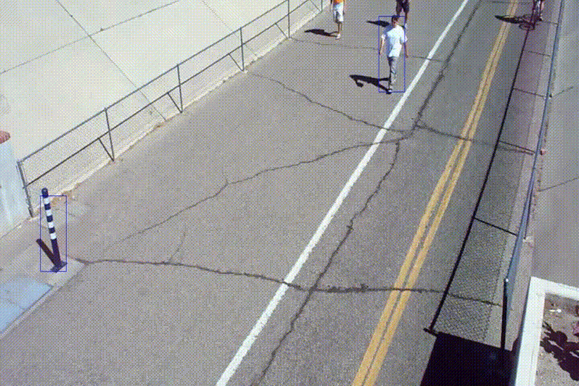

# Multi-Pedestrian Tracking based on KF and PF

This code is for EL2320 (Applied Estimation) Course Project at KTH. 

This project mainly focuses on exploring multi-object tracking with Kalman Filter and Particle Filter. We directly use the ACF pedestrian detection model provided by MATLAB, but combine simple morphological operations to improve its detecting results. Most importantly, Hungarian algorithm is used to associate observation with trackers. Besides the estimated position and size, historical motion orientation is also considered in its loss function, so as to deal with the scene of splits and merges. 

Theoretical details, please read through the report  [Project Report](report/Project_Report_Jiangpeng_Tao.pdf) 

We wrote most code by ourselves from scratch, partially using the code in LAB1 and LAB2, as well as the code about observation model from motion-based multiple object tracking in Mathwork: http://se.mathworks.com/help/vision/ug/multiple-object-tracking.html. 

## File
* "Init": initialize the parameters;
* "Kalman": the core algorithm for Kalman Filer;
* "Particle": the core algorithm for Particle Filter;
* "Process": used to create, delete trackers, draw results, detect pedestrians;
* "Video": Video samples;
* “media”: experiment results
* Kmain: the main function for Kalman Filter, use it like: Kmain("Video");
* Pmain: the main function for particle filter, use it like: Pmain("Video");

## Result sample

Sometimes the result is limited by the detection accuracy

